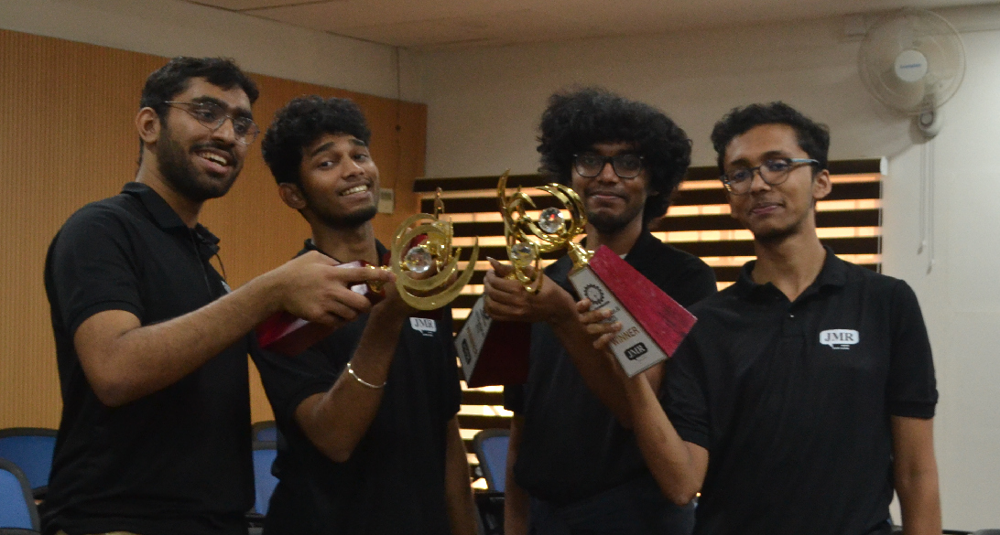

# Skedulr

This was a project that we built for the NITCkathos conducted by JMR Infotech. It was an AI hackathon for which the problem statement was to build a chatbot that would parse natural language and be able to schedule messages based on the text entered by the user.

The project involves four parts:

- [Galactus](https://github.com/skedulr/galactus): The centralised backend of the Skedulr system. Acts as the intermediary between all the other micro-services.
- [Botty](https://github.com/skedulr/botty): Presently a Discord bot that receives a command from the user and passes it along to the user. Can be extended to be a bot for any application following a certain API spec.
- [MLE](https://github.com/skedulr/ml-engine): The ML engine for extraction of events from conversational queries by users. Parses a natural language and returns a parsed query.
- [Molu](https://github.com/skedulr/molu): The mailing system in Skedulr. Receives information from Galactus, creates an ics file and mails it to the relevant party using the Gmail API.

Our final presentation can be found [here](../presentation.pdf).

---

UPDATE: We won!

